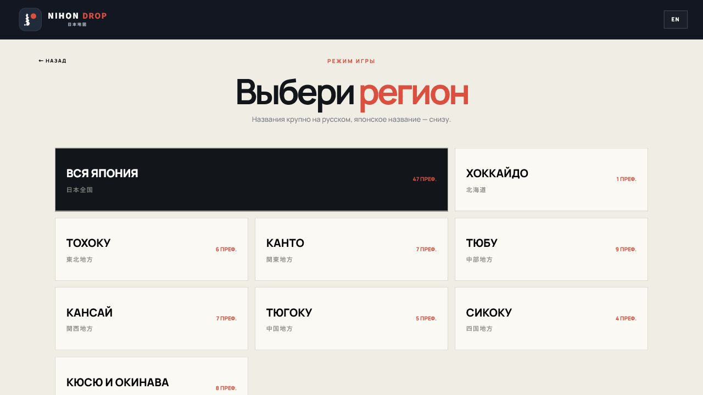
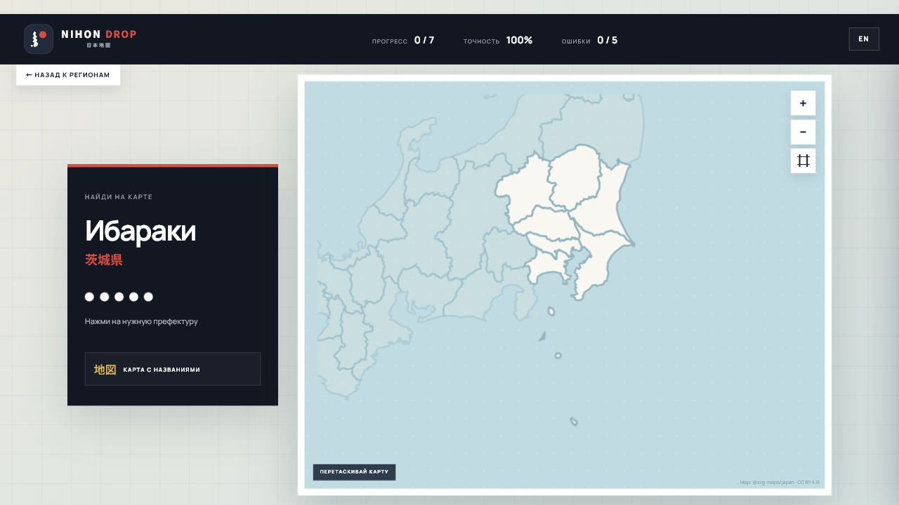

<div align="center">
  
  <h1>NIHON DROP</h1>
  <p><strong>Interactive bilingual quiz for learning the 47 prefectures of Japan by location.</strong></p>

  [](https://assigniter.github.io/nihon-drop/)
  [](https://assigniter.github.io/nihon-drop/)
  [](#features)
</div>

## Live Demo

**Play online:** [assigniter.github.io/nihon-drop](https://assigniter.github.io/nihon-drop/)

No installation, registration, or backend is required.


## About

NIHON DROP is a geography practice game inspired by map quizzes. The game gives you the name of a Japanese prefecture, and you must find its real shape on an interactive map.

Choose all of Japan or focus on one **chihō (地方)**. A correct first guess is marked green, a correct answer after mistakes is marked yellow, and after five failed attempts the answer is revealed.

## Screenshots

| Region selection | Quiz mode |
| --- | --- |
|  |  |

## Features

- All 47 Japanese prefectures with real SVG boundaries
- Practice across Japan or by one of eight chihō regions
- Russian and English interface
- Five attempts before the correct prefecture is revealed
- Green and yellow feedback based on the number of attempts
- Automatic zoom for regional practice
- Manual zoom, reset, and drag controls
- Optional labeled reference map
- Browser back/forward navigation between app screens
- Responsive layout and reduced-motion accessibility support
- Static deployment with no framework or backend

## How To Play

1. Open the [live demo](https://assigniter.github.io/nihon-drop/).
2. Select all of Japan or a chihō.
3. Read the prefecture name shown beside the map.
4. Click its location on the map.
5. Complete every prefecture in the selected region.

## Run Locally

Clone the repository and serve the directory with any static web server:

```bash
git clone https://github.com/ASSIGNITER/nihon-drop.git
cd nihon-drop
python -m http.server 8000
```

Then open `http://localhost:8000`.

The project can also be opened directly through `index.html`, although a local server is recommended.

## Project Structure

```text
nihon-drop/
├── index.html              # Application markup and visual motion styles
├── styles.css              # Main responsive styling
├── app.js                  # Game state, navigation, zoom, and interactions
├── map-data.js             # SVG paths for the 47 prefectures
├── favicon.svg             # Project icon and logo mark
├── japan-reference.png     # Optional labeled reference map
└── docs/
    ├── ARCHITECTURE.md
    └── screenshots/
```

## Technology

- Semantic HTML5
- CSS3 animations and responsive layout
- Vanilla JavaScript
- Inline SVG map rendering
- GitHub Pages

## Documentation

- [Architecture and game flow](docs/ARCHITECTURE.md)
- [Contributing](CONTRIBUTING.md)

## Credits

Prefecture SVG boundaries are provided by [`@svg-maps/japan`](https://www.npmjs.com/package/@svg-maps/japan) under the [CC BY 4.0](https://creativecommons.org/licenses/by/4.0/) license.

The labeled reference map is included as an optional learning aid and remains credited within the original image.

## Author

Created by [ASSIGNITER](https://github.com/ASSIGNITER).
